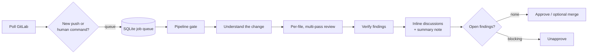

<div align="center">

# ai-cr

**Automated GitLab merge request code review, powered by a local LLM.**

Your code never leaves your machine.

[](LICENSE)
[](https://www.python.org/)
[](https://github.com/langchain-ai/langgraph)
[](#deployment-macos-launchd)

**English** · [简体中文](README.zh-CN.md)

</div>

---

`ai-cr` is a code review agent built on [LangGraph](https://github.com/langchain-ai/langgraph). It polls GitLab for merge requests, reviews each changed file along several dimensions, verifies its own findings to weed out false positives, posts inline discussions plus a summary, and automatically approves or un-approves the MR. It then tracks every finding through its whole lifecycle: dispute, escalation to a human, and fix verification.

It runs entirely against a local, OpenAI-compatible model server (tested with LM Studio and Qwen3.6-35B-A3B), so no source code is sent to a third-party API.

## Table of contents

- [Features](#features)
- [How it works](#how-it-works)
- [Requirements](#requirements)
- [Quick start](#quick-start)
- [Local model setup](#local-model-setup)
- [Configuration](#configuration)
- [Usage](#usage)
- [Deployment (macOS launchd)](#deployment-macos-launchd)
- [Finding lifecycle](#finding-lifecycle)
- [Static analysis](#static-analysis)
- [Pipeline gate and merge gate](#pipeline-gate-and-merge-gate)
- [Development](#development)
- [Evaluation](#evaluation)
- [License](#license)

## Features

- **Local-first.** Talks to any OpenAI-compatible endpoint; no code leaves your machine.
- **Multi-pass review.** Each file is reviewed along separate dimensions (correctness, robustness, security & performance). Tests and light files (proto, yaml, …) get their own cheaper checklists.
- **Self-verification.** Every finding is re-checked by the model before it is posted. P0 findings always need a majority vote.
- **Finding lifecycle.** Developers can reply "false positive" or "fixed"; the agent re-evaluates, resolves, reopens, or escalates to a human reviewer.
- **Incremental.** A new push only re-reviews what changed, and checks whether open findings were fixed.
- **Static analysis.** `golangci-lint` runs on the target branch and on the MR, and only newly introduced issues are reported.
- **Pipeline-aware.** Waits for the MR's CI pipeline before reviewing; notifies the author if it failed.
- **Merge gate.** Approves only when no finding is left open; un-approves on blocking findings. Optional auto-merge of the reviewed commit.
- **Crash-safe.** A SQLite-backed job queue with LangGraph checkpoints; interrupted jobs resume after a restart or a model reload.
- **Observable.** A local web UI shows the job queue, per-file progress, findings, and the full prompt and reply of every model call.

## How it works



Jobs are consumed serially: the local model handles one MR at a time, so several MRs pushed together simply queue up and do not increase memory use.

## Requirements

- Python 3.12+ and [uv](https://docs.astral.sh/uv/)
- A GitLab account for the bot (a personal access token with the `api` scope)
- A local OpenAI-compatible model server. The reference setup is LM Studio + Qwen3.6-35B-A3B (GGUF) on a 48 GB Apple Silicon Mac.
- SSH access to your GitLab (the default) or an HTTP token, for fetching code via bare mirrors
- Optional: `golangci-lint` for Go repositories

## Quick start

```bash
git clone git@github.com:bitailab/ai-codereview-agent.git
cd ai-codereview-agent

cp .env.example .env                  # GITLAB_URL, GITLAB_TOKEN, model endpoint and name
cp config.example.yaml config.yaml    # project list and human_reviewer (your GitLab username)
uv sync
uv run ai-cr check                    # verifies the GitLab account, repo access and model connectivity

uv run ai-cr review my-group/service-a 123 --dry-run   # try it: prints the review, posts nothing
```

Code is fetched through bare mirrors in `data/mirrors/` (SSH by default, so your GitLab SSH key must be set up). Your own working copy is never touched.

## Local model setup

Install LM Studio (`brew install --cask lm-studio`) and use the **GGUF / llama.cpp** build of Qwen3.6-35B-A3B. Do not use the MLX build: on macOS 15 it can trigger a kernel panic (`IOGPUMemory prepare count underflow`).

Download unsloth's `Qwen3.6-35B-A3B-UD-Q4_K_M.gguf` (about 22 GB) and swap in a chat template that understands `/no_think`, so the review pass runs without thinking and the verify pass runs with thinking:

```bash
dst=~/.lmstudio/models/local/qwen3.6-35b-a3b-gguf-switch; mkdir -p $dst
uv run --no-project --with gguf gguf-new-metadata --chat-template-file deploy/qwen3.6-switch.jinja \
  Qwen3.6-35B-A3B-UD-Q4_K_M.gguf $dst/Qwen3.6-35B-A3B-UD-Q4_K_M-switch.gguf
```

`deploy/start-model.sh` starts the server (port 1234) and loads the model with a 40K context and a single parallel slot. It is run automatically at login (see [Deployment](#deployment-macos-launchd)) and can also be run by hand.

> [!IMPORTANT]
> **Always set the context length explicitly** (`-c 40960` in the script). Without it the server falls back to a small default context and silently truncates the prompt. On a 48 GB machine do not raise it further, or GPU memory runs out and the display glitches or the machine hangs.
>
> The script verifies the context length that was actually loaded and reloads the model if it differs, and uses a file lock so only one instance runs at a time.
>
> Each extra parallel slot costs its own KV cache, so `--parallel` is kept at 1 and ai-cr calls the model serially.

If you use `mlx_lm.server` instead, set `LLM_STRUCTURED_MODE=text` in `.env`.

**Measured** (M4 Pro 48 GB, Qwen3.6 GGUF): a real MR with 40 files takes about 70 minutes (about 1.7 minutes per file, verification included). Re-checking after a developer disputes a finding takes about 40 seconds.

## Configuration

Secrets and the model endpoint live in `.env` (see [`.env.example`](.env.example)); everything else is in `config.yaml` (see [`config.example.yaml`](config.example.yaml), which documents every option).

Key settings:

| Setting | Meaning |
|---|---|
| `projects` | GitLab project paths to watch |
| `human_reviewer` | Triggers a review when they are reviewer or assignee; gets @-mentioned on escalations; the only user whose `/ai-*` commands are honored |
| `review.passes` | Review dimensions; keep a single `all` for speed |
| `review.verify_votes` | Verification votes (odd number). P0 always uses a majority vote |
| `review.static_analysis` | `golangci-lint` settings and severity mapping |
| `pipeline` | Wait for CI before reviewing |
| `lifecycle.auto_approve` | Approve or un-approve automatically |
| `lifecycle.auto_merge` | Merge right after approving. **Off by default** |

### Per-repository rules

A repository can ship an optional `.ai-review.yaml`:

```yaml
ignore: ["docs/*", "*.gen.go"]
rules:
  - All outbound HTTP calls must set a timeout
  - Do not use context.Background() directly in a handler
```

`CLAUDE.md` / `AGENTS.md` at the repository root is injected as coding guidelines.

### Auto-merge

With `lifecycle.auto_merge: true`, the agent merges an MR right after it approves it. It merges only the commit that was reviewed (the `sha` is passed to GitLab), so a push made after the review is rejected rather than merged unreviewed. If GitLab refuses (conflicts, unmet merge conditions, missing permissions) it is only logged and does not fail the job. The bot account needs at least Developer permission, and a project that requires several approvals will not be satisfied by the bot's single approval.

## Usage

```bash
uv run ai-cr review my-group/service-a 123 --dry-run    # print only, post nothing
uv run ai-cr review <project> <iid> --full              # review now and post to GitLab
uv run ai-cr run                                        # long-running: poll + process jobs
uv run ai-cr poll                                       # poll once and enqueue, do not process
uv run ai-cr status <project> <iid>                     # findings and audit log of an MR
uv run ai-cr ui [--port 8765]                           # local web UI
```

The web UI shows the job queue, per-file progress, findings, and the prompt and reply of every model call.

### Commands in MR comments

| Command | Effect |
|---|---|
| `/ai-confirm [reason]` | The finding is valid (human reviewer only) |
| `/ai-accept [reason]` | Let it through; resolving the thread has the same effect (human reviewer only) |
| `/ai-downgrade P2` | Change the severity (human reviewer only) |
| `/ai-review` | Full re-review, skipping the pipeline wait (anyone) |

## Deployment (macOS launchd)

`./deploy/install.sh` installs three launchd jobs. Re-run it after changing `start-model.sh` or a plist.

| Job | Purpose | Log |
|---|---|---|
| `com.aicr.model` | Starts LM Studio and loads the model at login; retries after 60 s on failure | `~/.local/share/ai-cr/model.log` |
| `com.aicr.agent` | Long-running poller and reviewer; restarted if it exits | `data/agent.log` |
| `com.aicr.ui` | Read-only status page at http://127.0.0.1:8765 | `data/ui.log` |

On every cycle the agent checks that the model is loaded with at least a 32K context. If it is not ready, the agent only polls and keeps jobs queued, then continues automatically once the model is up. While the agent runs on AC power it prevents idle sleep (`caffeinate`).

The model script is installed to `~/.local/share/ai-cr/` because zsh under launchd has no permission to read `~/Documents`.

To stop a job: `launchctl bootout gui/$(id -u)/com.aicr.agent` (the same for the model).

## Finding lifecycle

| Situation | Agent behavior |
|---|---|
| New MR or new push | Reviews the changed files incrementally and opens inline discussions for new findings. Also verifies whether all open findings are fixed. |
| Developer replies "false positive" with a reason | The model re-checks. If it agrees, the finding is withdrawn and resolved. If it insists, P0/P1 is escalated by @-mentioning `human_reviewer` and adding the `ai-review::needs-human` label; P2 is let through. |
| Developer replies "fixed" or resolves the thread | Verified against the current head. If it is not fixed, the agent explains why and reopens the discussion. |
| Developer says it will be handled later | P1/P2 are recorded as deferred and do not block; P0 is escalated to a human. |
| `human_reviewer` commands | See [Commands in MR comments](#commands-in-mr-comments). |

## Static analysis

`golangci-lint` follows the repository's own `.golangci.yml` (v1 configs are migrated automatically) and additionally enables `unused`. It runs once on the target branch and once on the MR, and only the issues the MR introduces are reported. This catches problems that do not sit on a changed line, such as dead code left behind when a caller is deleted.

Lint findings skip model verification and are mapped to severities by linter (`errcheck`, `govet`, `staticcheck`, … are P1). A finding that disappears is marked fixed automatically.

Packages whose Go files all require a custom build tag (for example `//go:build integration`) are skipped, because `golangci-lint` cannot load them and would fail the whole run.

`golangci-lint` must match the repository's Go version. For example, for a repository that needs Go 1.27:

```bash
GOTOOLCHAIN=go1.27.1 GOBIN=~/.local/share/ai-cr/bin go install github.com/golangci/golangci-lint/v2/cmd/golangci-lint@latest
```

## Pipeline gate and merge gate

**Pipeline gate.** After a new commit is detected, if the MR has a pipeline, the agent waits for it:

- Running: wait and re-check every poll (a finished pipeline does not update the MR's `updated_at`, so the agent checks actively).
- Passed: start the review.
- Failed or canceled: do not review. A note at the top of the summary asks the author to fix it first (the previous review result is kept). The review starts automatically once a retry passes or a fix is pushed.
- No pipeline (none created 5 minutes after the push) or running longer than 3 hours: review right away.
- Commenting `/ai-review` skips the wait.

**Merge gate.**

| State | Action |
|---|---|
| A P0 is still open | Un-approve |
| A P1 is unfixed and unexplained | Un-approve |
| Only suggestions or items awaiting a ruling are left | Leave the approval state unchanged |
| Every finding is closed | Approve (and merge, if `auto_merge` is on) |

## Development

```bash
uv run pytest -q
```

The unit tests use a fake model, so they cannot catch prompt or model regressions. See below.

## Evaluation

Run the real-model evaluation after changing a prompt, switching the model, or tuning parameters:

```bash
# Synthetic cases S1–S5 (recall / false positives), D1/D2 (developer disputes),
# F1/F2 (fix verification); about 20–30 minutes
caffeinate -i uv run python eval/model_eval.py <label> /tmp/eval.json --skip-real

# Dry-run on a real MR (writes nothing to GitLab; merged MRs work too).
# Progress is checkpointed in data/eval_checkpoints.db, so a re-run resumes.
caffeinate -i uv run python eval/real_mr.py <project_path> <mr_iid>
```

A 48 GB machine can hold only one model at a time; do not let the agent process jobs while an evaluation is running.

## License

Released under the [MIT License](LICENSE). Copyright (c) 2026 bitailab.
