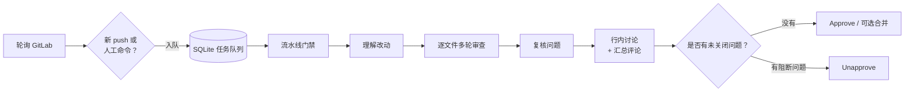
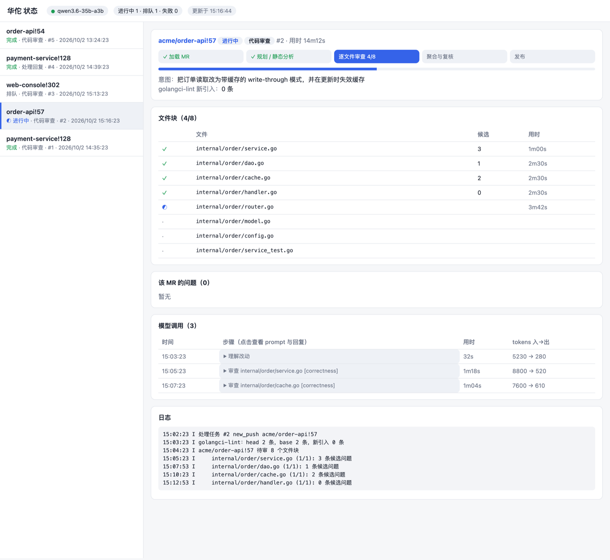
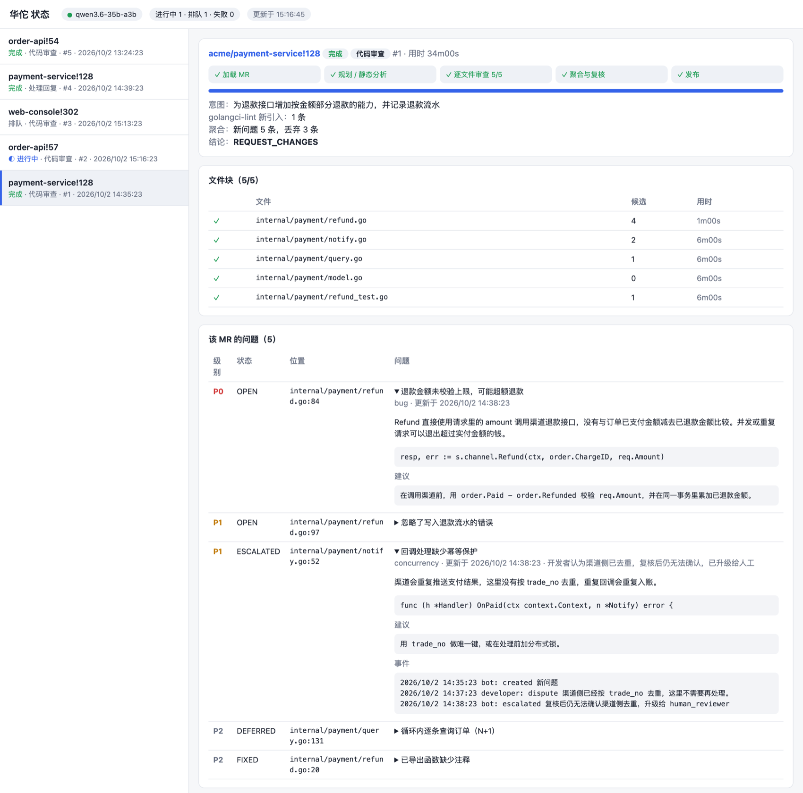
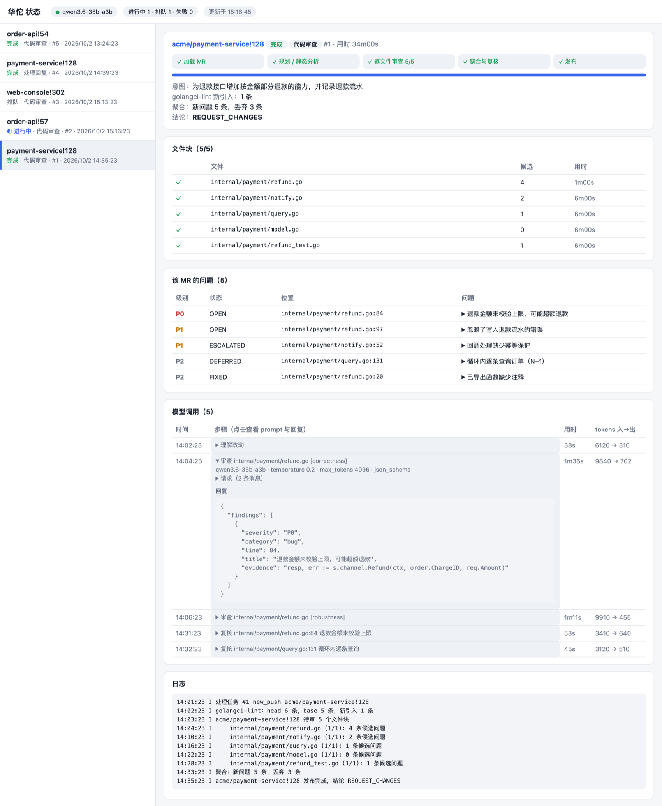

<div align="center">

# 华佗 Huatuo

**基于本地大模型的 GitLab MR 自动代码审查。**

私有化部署、数据安全优先：代码和数据都留在你自己的机器上，不依赖任何外部服务。

*取名自中国古代神医华佗：为你的代码“望闻问切”。*

[](LICENSE)
[](https://www.python.org/)
[](https://github.com/langchain-ai/langgraph)
[](#部署macos-launchd)

[English](README.md) · **简体中文**

</div>

---

华佗是基于 [LangGraph](https://github.com/langchain-ai/langgraph) 的代码审查 Agent：轮询 GitLab 上的合并请求（MR），按文件分维度审查，对发现的问题再做一轮复核以去除误报，发布行内讨论和汇总评论，并自动 approve / unapprove。之后它会跟踪每个问题的完整生命周期：开发者反驳、升级人工、修复验证。

它完全运行在你自己的硬件上，使用本地的、兼容 OpenAI 接口的模型服务（已用 LM Studio 加 Qwen3.6-35B-A3B 验证）和你自己的 GitLab，不依赖任何外部服务，源码不会发送给任何第三方 API。它具体会访问什么、保存什么，见[安全与隐私](#安全与隐私)。

## 目录

- [特性](#特性)
- [工作原理](#工作原理)
- [安全与隐私](#安全与隐私)
- [环境要求](#环境要求)
- [快速开始](#快速开始)
- [本地模型准备](#本地模型准备)
- [配置](#配置)
- [使用](#使用)
- [部署（macOS launchd）](#部署macos-launchd)
- [开发与发布](#开发与发布)
- [问题生命周期](#问题生命周期)
- [静态分析](#静态分析)
- [流水线门禁与合并门禁](#流水线门禁与合并门禁)
- [开发](#开发)
- [评测](#评测)
- [许可证](#许可证)

## 特性

- **本地化，隐私优先。** 完全运行在你自己的机器上，使用本地模型；对端只有你的 GitLab 和你的模型服务。没有云端 API，没有遥测，代码不出你的环境。
- **多轮分维度审查。** 每个文件按正确性、健壮性、安全与性能分别审查；测试文件和轻量文件（proto、yaml 等）使用各自更轻的清单。
- **自我复核。** 每个问题发布前都由模型再复核一遍，P0 一律需要多数票通过。
- **问题生命周期。** 开发者可以回复“误报”或“已修复”，Agent 会重新评估、resolve、重新打开或升级给人工。
- **增量审查。** 新 push 只审查有变化的部分，并检查未关闭的问题是否已修复。
- **静态分析。** 在目标分支和 MR 上各跑一次 `golangci-lint`，只报告本次新引入的问题。
- **感知流水线。** 审查前先等 MR 的 CI 流水线；失败时提示作者。
- **合并门禁。** 没有未关闭问题才 approve，有阻断问题则 unapprove；可选自动合并已审查的提交。
- **崩溃可恢复。** 基于 SQLite 的任务队列加 LangGraph checkpoint，服务重启或模型重载后任务会继续。
- **可观测。** 本地状态页展示任务队列、逐文件进度、问题列表，以及每次模型调用的完整 prompt 与回复。

## 工作原理



任务串行消费：本地模型一次只处理一个 MR，因此多个 MR 同时推送只会排队，不会增加内存占用。

## 安全与隐私

华佗面向不能、或者不愿意把源码交给第三方的团队。所有环节都在你自己的机器上，对接你自己的 GitLab 和你自己的模型。没有 SaaS 组件，不需要注册账号，没有授权服务器，也没有任何遥测。

**它会访问谁。** 运行时只有这两个网络对端：

| 对端 | 用途 | 配置位置 |
|---|---|---|
| 你的 GitLab（API，以及基于 SSH 或 HTTPS 的 `git`） | 读取 MR 与代码；发评论、approve | `.env` 里的 `GITLAB_URL`，`config.yaml` 里的 `git_url_style` |
| 你的模型服务 | 执行审查 | `.env` 里的 `LLM_BASE_URL`，默认 `http://127.0.0.1:1234/v1` |

除此之外不会访问任何地址：没有云端大模型 API，没有包或模型下载，没有统计或崩溃上报。模型权重和 Python 依赖只在安装阶段下载一次，之后只要能连上你的 GitLab，系统不需要互联网就能运行。

**哪些数据留在本机。**
- 代码通过 `data/mirrors/` 下的 bare mirror 读取，不会被复制到别处。审查状态、问题和任务历史都存在 `data/` 下的本地 SQLite 文件里。
- 审查结果只会以评论、标签和 approve 的形式回到你自己的 GitLab。
- 状态页只监听 `127.0.0.1`，只读，不加载任何外部字体、脚本或图片。
- `.env`（含 GitLab token）和 `data/` 已加入 `.gitignore`。

**你需要了解并掌控的事项。**
- `data/llm_trace.db` 会保存每次模型调用的完整 prompt 和回复，也就是源码，默认保留 7 天（`LLM_TRACE_DAYS`），供状态页查看。设置 `LLM_TRACE=false` 可以关闭，或者对 `data/` 做磁盘加密并收紧权限。
- `data/` 下的 mirror、worktree 和日志里同样含有代码，请把整个目录当作敏感数据。
- 使用专用的 bot 账号，token 只给必要的权限。`git_url_style: http` 时 token 会以请求头的形式传给 `git`，用 SSH 可以避免。
- 华佗不会阻止你把 `LLM_BASE_URL` 指向远程地址，那样代码就会发到那里。要强制“只允许本地”，请加一条出站规则，只放行你的 GitLab 地址和 `127.0.0.1`。
- 模型服务是独立的程序，有它自己的联网行为，比如 LM Studio 可能会检查更新，请按你的安全策略配置它或者用防火墙限制。本节说的都是华佗自身的行为。
- LangChain 可选的 LangSmith 追踪默认关闭，除非你设置它的环境变量（`LANGSMITH_*`），请不要设置。
- 仓库内容对模型来说是不可信输入，MR 里的评论或文件可能试图影响审查结果。问题会经过复核，级别有上限（比如测试文件最高 P2），并且可以在 `config.yaml` 里[集中指定跳过哪些文件](#集中配置跳过的文件)，开发者无法自己把代码排除在审查之外。

上面的说法你可以自己验证：代码量不大，`grep -rn "http" src/` 能列出所有处理 URL 的地方。

## 环境要求

- Python 3.12+ 与 [uv](https://docs.astral.sh/uv/)
- 一个供机器人使用的 GitLab 账号（scope 为 `api` 的 Personal Access Token）
- 本地兼容 OpenAI 接口的模型服务。参考配置为 48 GB Apple Silicon Mac 上的 LM Studio + Qwen3.6-35B-A3B（GGUF）
- 通过 bare mirror 获取代码，需要 GitLab 的 SSH 访问（默认）或 HTTP token
- 可选：Go 仓库需要 `golangci-lint`

## 快速开始

> 命令行工具和 Python 包的名字是 `huatuo`，旧的命令名 `ai-cr` 仍可作为别名使用。

```bash
git clone git@github.com:bitailab/ai-codereview-agent.git
cd ai-codereview-agent

cp .env.example .env                  # 填 GITLAB_URL、GITLAB_TOKEN、模型地址与名称
cp config.example.yaml config.yaml    # 填仓库列表和 human_reviewer（你的 GitLab 用户名）
uv sync
uv run huatuo check                    # 检查 GitLab 账号、仓库权限、模型连通性

uv run huatuo review my-group/service-a 123 --dry-run   # 试跑：只打印审查结果，不提交
```

代码通过 `data/mirrors/` 下的 bare mirror 获取（默认走 SSH，需要本机已配置 GitLab SSH key），不会动你本地的工作区。

## 本地模型准备

安装 LM Studio（`brew install --cask lm-studio`），使用 **GGUF + llama.cpp 引擎**的 Qwen3.6-35B-A3B。不要用 MLX 版：在 macOS 15 上会触发内核 panic（`IOGPUMemory prepare count underflow`）。

下载 unsloth 的 `Qwen3.6-35B-A3B-UD-Q4_K_M.gguf`（约 22 GB），并替换为能识别 `/no_think` 的对话模板，让审查不思考、复核思考：

```bash
dst=~/.lmstudio/models/local/qwen3.6-35b-a3b-gguf-switch; mkdir -p $dst
uv run --no-project --with gguf gguf-new-metadata --chat-template-file deploy/qwen3.6-switch.jinja \
  Qwen3.6-35B-A3B-UD-Q4_K_M.gguf $dst/Qwen3.6-35B-A3B-UD-Q4_K_M-switch.gguf
```

`deploy/start-model.sh` 会启动服务（端口 1234），并以 96K 上下文、单并发加载模型。它由开机自启任务自动执行（见[部署](#部署macos-launchd)），也可以手动运行。

> [!IMPORTANT]
> **必须显式指定上下文长度**（脚本里是 `-c 98304`），否则服务会使用默认的小上下文，内容会被静默截断。48GB 机器上该模型的 KV 缓存很小（约 20KB/token），96K 上下文只比约 22GB 的权重多占约 2GB；再大没有测过，GPU 内存耗尽会花屏死机。
>
> 脚本会检查实际加载的上下文长度，不对就重新加载，并用文件锁保证同一时间只有一个实例在运行。
>
> 每多一个并发槽位都要多占一份 KV cache，所以 `--parallel` 保持为 1，华佗也是串行调用模型。

如果改用 `mlx_lm.server`，请在 `.env` 中设置 `LLM_STRUCTURED_MODE=text`。

**实测**（M4 Pro 48GB，Qwen3.6 GGUF）：40 个文件的真实 MR 约 70 分钟（平均每个文件约 1.7 分钟，含复核）；开发者反驳后的复核约 40 秒。

## 配置

密钥和模型地址放在 `.env`（见 [`.env.example`](.env.example)），其余都在 `config.yaml`（见 [`config.example.yaml`](config.example.yaml)，每个选项都有注释）。

主要配置项：

| 配置项 | 含义 |
|---|---|
| `projects` | 需要监控的 GitLab 仓库路径 |
| `human_reviewer` | 作为 reviewer 或 assignee 时触发审查；争议升级时 @ 这个人；只接受这个人的 `/ai-*` 命令 |
| `review.passes` | 审查维度；想加快可只留一个 `all` |
| `review.verify_votes` | 复核投票次数（奇数）。P0 固定多数票 |
| `review.static_analysis` | `golangci-lint` 设置与级别映射 |
| `review.project_ignore` | 按仓库指定的忽略规则，由部署方集中管理，例如 `my-group/service-a: ["deploy/*"]` |
| `review.allow_repo_ignore` | 是否采纳仓库内 `.ai-review.yaml` 的 `ignore`（默认 `true`） |
| `pipeline` | 审查前是否等待 CI |
| `lifecycle.auto_approve` | 是否自动 approve / unapprove |
| `lifecycle.auto_merge` | approve 之后自动合并，**默认关闭** |

### 仓库级规则

仓库可以放置可选的 `.ai-review.yaml`：

```yaml
ignore: ["docs/*", "*.gen.go"]
rules:
  - 所有对外 HTTP 调用必须设置超时
  - 禁止在 handler 中直接使用 context.Background()
```

仓库根目录的 `CLAUDE.md` / `AGENTS.md` 会作为规范注入。

### 集中配置跳过的文件

规则使用 `fnmatch`，同时匹配完整路径和文件名，`*` 也可以跨目录。要跳过某个项目的 CD 脚本，把它们写进 `config.yaml`，开发者无法修改：

```yaml
review:
  project_ignore:
    my-group/service-a:
      - "deploy/*"       # 仓库根目录的 deploy/
      - "*/deploy/*"     # 子目录下的 deploy/
  allow_repo_ignore: false
```

`.ai-review.yaml` 是从 MR 自己的 head 提交里读取的，开发者可以借它的 `ignore` 把代码排除在审查之外。设置 `allow_repo_ignore: false` 后会忽略这份列表，只由 `config.yaml` 决定（仓库里的 `rules` 仍然生效）。被忽略的文件既不审查也不 lint，也不占 `max_files` 的名额。

### 自动合并

设置 `lifecycle.auto_merge: true` 后，Agent 在 approve 之后会立即合并该 MR。它只合并已审查的那个提交（会把 `sha` 传给 GitLab），所以审查之后又有新的推送时会被拒绝，不会把没审过的代码合进去。GitLab 拒绝合并（有冲突、未满足合并条件、没有权限）时只记日志，不会让任务失败。机器人账号至少需要 Developer 权限；如果项目要求多人审批，机器人一个人的 approve 不够。

## 使用

```bash
uv run huatuo review my-group/service-a 123 --dry-run    # 试跑，只打印不提交
uv run huatuo review <project> <iid> --full              # 立即审查并提交
uv run huatuo run                                        # 常驻：轮询 + 处理任务
uv run huatuo poll                                       # 只轮询一次并入队，不处理
uv run huatuo status <project> <iid>                     # 查看某个 MR 的问题状态与审计日志
uv run huatuo ui [--port 8765]                           # 本地状态页
```

### Web 状态页

`huatuo ui` 提供一个只读的状态页，只监听 `127.0.0.1`。它展示任务队列、逐文件进度、每个 MR 的问题列表，以及每次模型调用的完整 prompt 与回复。（下面的截图使用的是虚构的演示数据。）

**任务队列与实时进度**



**问题列表及其生命周期事件**



**每次模型调用的 prompt 与回复**




### MR 评论命令

| 命令 | 作用 |
|---|---|
| `/ai-confirm [理由]` | 问题成立（仅 human_reviewer） |
| `/ai-accept [理由]` | 放行，直接 resolve 讨论效果相同（仅 human_reviewer） |
| `/ai-downgrade P2` | 调整级别（仅 human_reviewer） |
| `/ai-review` | 全量重审并跳过流水线等待（任何人可用） |

`/huatuo-confirm`、`/huatuo-accept`、`/huatuo-downgrade`、`/huatuo-review` 也可以作为别名使用。

## 部署（macOS launchd）

`./deploy/install.sh` 会安装三个 launchd 任务；修改 `start-model.sh` 或 plist 后重新运行一次即可。

| 任务 | 作用 | 日志 |
|---|---|---|
| `com.huatuo.model` | 登录时启动 LM Studio 并加载模型，失败 60 秒后重试 | `~/.local/share/huatuo/model.log` |
| `com.huatuo.agent` | 常驻轮询 + 审查，进程退出会自动重启 | `data/agent.log` |
| `com.huatuo.ui` | 只读状态页 http://127.0.0.1:8765 | `data/ui.log` |

Agent 每一轮都会检查模型是否已按至少 32K 的上下文加载。未就绪时只轮询、不处理任务，任务保持排队，模型就绪后自动继续。接电源时 Agent 会阻止系统闲置睡眠（`caffeinate`）。

模型脚本被安装到 `~/.local/share/huatuo/`，因为 launchd 下的 zsh 没有读取 `~/Documents` 的权限。

从旧名称（`ai-cr`）升级：重新运行 `./deploy/install.sh` 即可。它会搬迁脚本目录，卸载旧的 `com.aicr.*` 任务，并安装 `com.huatuo.*`。

停止任务：`launchctl bootout gui/$(id -u)/com.huatuo.agent`（模型同理）。

## 开发与发布

开发和生产是**两个目录**。服务读取的 `.env`、`config.yaml`、`prompts/` 和 `data/` 都相对代码所在目录（`settings.py` 的 `ROOT`），所以隔离靠目录，不靠代码里的开关。

| | 开发目录 | 生产目录 |
|---|---|---|
| 位置 | 日常工作的克隆，如 `~/Documents/src/ai_cr` | 单独的克隆，如 `~/.local/share/huatuo/prod`（不要放在 `~/Documents` 下，launchd 下的命令读不了） |
| 代码 | 修改、提交、打 tag、推送 | 只拉取已打 tag 的版本，不手改 |
| launchd 服务 | 不安装 | `com.huatuo.*` 的 `WorkingDirectory` 指向这里 |
| `config.yaml` | `projects` 留空或只放测试仓库；用 `huatuo review --dry-run` 看结果，不写 GitLab | 真实仓库 |
| `data/` | 开发与基准数据 | 生产的 `state.db`、镜像、trace |

提示词每次调用都从 `prompts/` 重新读取，所以生产目录里不能直接改文件，改动必须通过发布进来。

发布：在开发目录提交、`git tag v2026.10.08`、`git push --tags`，然后在生产目录运行：

```bash
deploy/release.sh v2026.10.08          # 等队列空闲 → 切到该 tag → uv sync → 重启 agent 和 ui；起不来自动回滚
deploy/release.sh v2026.10.08 --force  # 不等队列空闲（会打断正在跑的任务，任务重新排队）
```

在开发目录里用 `HUATUO_PROD=~/.local/share/huatuo/prod deploy/release.sh <tag>` 也可以发布，脚本不会在切换版本时被改写。发布记录在生产目录的 `data/release.log`。回滚就是再发布上一个 tag。

首次建立生产目录：

```bash
git clone git@github.com:bitailab/ai-codereview-agent.git ~/.local/share/huatuo/prod
cd ~/.local/share/huatuo/prod && git checkout <tag>
cp <开发目录>/.env <开发目录>/config.yaml .
# 队列空闲时停服务，带上状态库（不带 state.db 会把所有 MR 当新的重审；mirrors 可以不搬，会重新拉取）
for s in agent ui; do launchctl bootout gui/$(id -u)/com.huatuo.$s; done
mkdir -p data && cp <开发目录>/data/{state.db*,checkpoints.db*,llm_trace.db*} data/
uv sync --frozen && ./deploy/install.sh   # 重新渲染 plist，指向生产目录
```

夜间基准仍在开发目录运行：它只负责停止和恢复生产的 `com.huatuo.agent`，结果写在开发目录的 `data/bench/`。

## 问题生命周期

| 场景 | Agent 行为 |
|---|---|
| 新 MR / 新 push | 增量审查改动文件，新问题发行内讨论；同时验证所有未关闭问题是否已修复 |
| 开发者回复“误报”并给出理由 | 模型复核：认可 → 撤回并 resolve；坚持 → P0/P1 @human_reviewer 并打 `ai-review::needs-human` 标签，P2 放行 |
| 开发者回复“已修复”或直接 resolve | 在当前 head 上验证；未修复会说明原因并重新打开讨论 |
| 开发者表示后续处理 | P1/P2 记为延期（不阻断）；P0 升级人工 |
| human_reviewer 命令 | 见 [MR 评论命令](#mr-评论命令) |

## 静态分析

`golangci-lint` 以仓库自己的 `.golangci.yml` 为准（v1 格式自动迁移），并额外启用 `unused`。它在目标分支和 MR 上各跑一次取差集，只报告本次 MR 新引入的问题，因此能发现“调用方被删导致的死代码”这类不在改动行上的问题。

lint 问题不经模型复核，按 linter 映射级别（`errcheck`、`govet`、`staticcheck` 等为 P1），问题消失即自动判定修复。

如果一个包的所有 Go 文件都依赖自定义 build tag（例如 `//go:build integration`），会被跳过，因为 `golangci-lint` 无法加载这样的包，会让整次检查失败。

`golangci-lint` 需与仓库的 Go 版本匹配，例如仓库要求 Go 1.27 时：

```bash
GOTOOLCHAIN=go1.27.1 GOBIN=~/.local/share/huatuo/bin go install github.com/golangci/golangci-lint/v2/cmd/golangci-lint@latest
```

## 流水线门禁与合并门禁

**流水线门禁。** 检测到新提交后，如果 MR 有流水线，会先等它跑完：

- 运行中：等待，每轮轮询重新检查（流水线结束不会更新 MR 的 `updated_at`，所以会主动检查）。
- 通过：开始审查。
- 失败或取消：不审查，在汇总评论顶部提示作者先修复（保留上一轮审查结果），重试通过或 push 修复后自动开始。
- 没有流水线（push 5 分钟后仍未创建）或跑超过 3 小时：直接审查。
- 评论 `/ai-review` 可跳过等待。

**合并门禁。**

| 状态 | 动作 |
|---|---|
| P0 未关闭 | unapprove |
| P1 未修复且无解释 | unapprove |
| 只剩建议或待裁决项 | 不改变审批状态 |
| 所有问题都已关闭 | approve（开启 `auto_merge` 时还会合并） |

## 开发

```bash
uv run pytest -q
```

单测用的是假模型，发现不了提示词或模型层面的退化，见下一节。

## 评测

改提示词、换模型、调参数之后必须跑真实模型评测：

```bash
# 合成用例 S1–S5（召回/误报）、D1/D2（开发者反驳）、F1/F2（修复验证），约 20–30 分钟
caffeinate -i uv run python eval/model_eval.py <标签> /tmp/eval.json --skip-real

# 真实 MR dry-run（不写 GitLab；已合并的 MR 也可以）。
# 进度存在 data/eval_checkpoints.db，中断后重跑会续跑
caffeinate -i uv run python eval/real_mr.py <project_path> <mr_iid>
```

48GB 机器同一时间只能加载一个模型；评测期间不要让 Agent 同时处理任务。

## 许可证

基于 [MIT 许可证](LICENSE) 发布。Copyright (c) 2026 bitailab。
